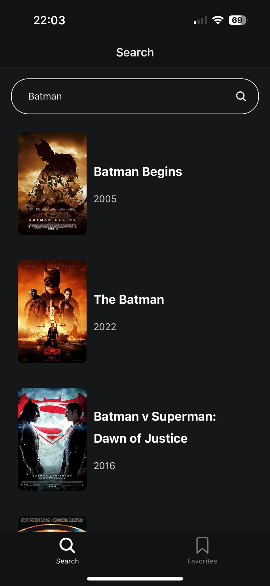

# Movie App 🎬

This is a mobile movie app built with [Expo](https://expo.dev/), allowing users to search for movies, view details, and save their favorite movies. The app leverages the [Movie Database Alternative API](https://rapidapi.com/rapidapi/api/movie-database-alternative) for fetching movie data.

The UI design is influenced by [this file](https://www.figma.com/community/file/1054431643740926668)

## Features ✨

- **Search Movies**: Easily search for your favorite movies by title.
- **View Details**: Click on a movie to see additional details such as IMDb rating and description.
- **Favorite Movies**: Save and manage a list of your favorite movies.
- **Persistent Favorites**: Your favorited movies are saved locally, even after closing the app.
- **Color Theme Support**: The app supports light and dark themes for a better user experience in different lighting conditions.

## Screenshots 📸



## Installation & Setup 🛠️

### Prerequisites

Make sure you have the following installed:

- [Node.js](https://nodejs.org/)
- [Expo CLI](https://docs.expo.dev/get-started/installation/)
- [Yarn](https://yarnpkg.com/) or npm

### Clone the Repository

```bash
git clone https://github.com/ekaynak94/movie-app.git
cd movie-app
```

## Installation & Setup 🛠️

### Install Dependencies

Run the following command to install the required packages:

```bash
yarn install
```

or using npm:

```bash
npm install
```

### Setup Environment Variables

Run the following command to install the required packages:

```.env
EXPO_PUBLIC_RAPIDAPI_KEY=your-rapid-api-key-here
```

### Run the App

After setting up, run the app with Expo:

```bash
yarn start
```

or using npm:

```bash
npm start
```

This will start the Expo development server, and you can scan the QR code with your phone to launch the app or run it in a simulator.

Enjoy!!
